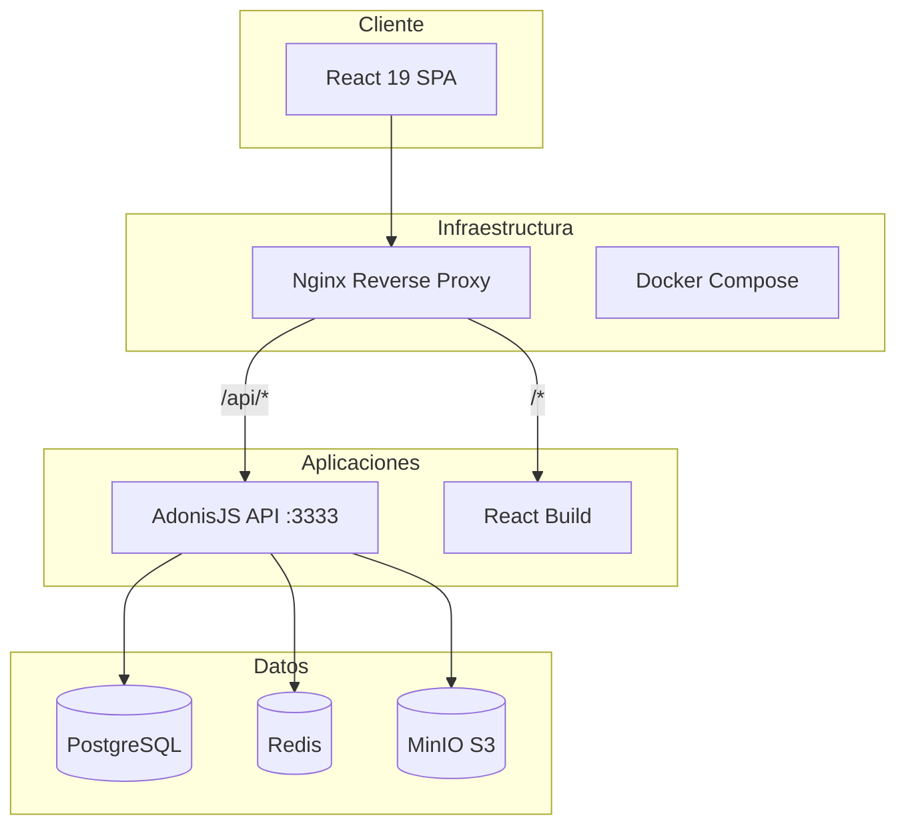
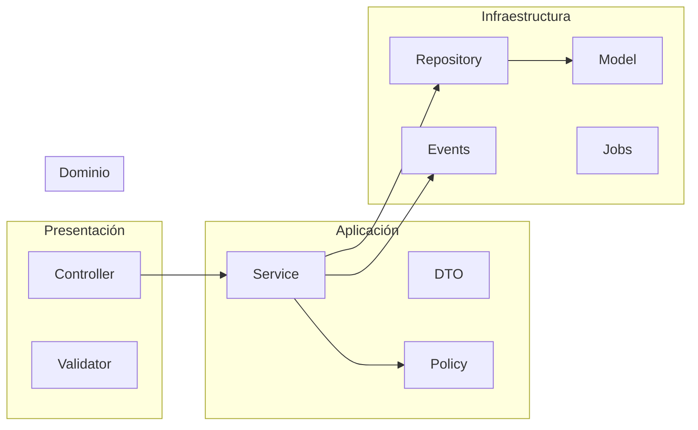

# Arquitectura del Sistema

## Stack tecnológico

| Capa | Tecnología |
|------|-----------|
| Frontend | React 19, Vite, TypeScript, Tailwind CSS |
| Backend | AdonisJS 6, TypeScript |
| Base de datos | PostgreSQL 16 |
| Cache/Queues | Redis 7 |
| Storage | MinIO (S3 compatible) |
| Contenedores | Docker, Docker Compose |
| Reverse Proxy | Nginx |
| Servidor | Ubuntu Server 22.04+ |

## Diagrama de arquitectura



## Estructura del monorepo

```
GNC-Workshop/
├── .cursor/rules/          # 16 reglas de contexto AI
├── apps/
│   ├── backend/            # AdonisJS 6 API
│   └── frontend/           # React 19 SPA
├── packages/
│   ├── shared-types/       # DTOs compartidos FE-BE
│   └── config/             # ESLint, TS, Prettier
├── infra/
│   ├── docker/             # Dockerfiles + compose
│   └── nginx/              # Config Nginx
└── docs/                   # Esta documentación
```

## Clean Architecture por módulo



## Comunicación entre módulos

Los módulos NO importan código de otros módulos directamente.
Comunicación exclusiva vía:

1. **Services públicos**: interfaz definida, implementación interna
2. **Events**: desacoplamiento para efectos secundarios
3. **shared-types**: contratos de datos compartidos

## Patrones aplicados

- **SOLID**: cada clase una responsabilidad
- **Repository Pattern**: abstracción de acceso a datos
- **Service Layer**: lógica de negocio centralizada
- **DTO**: transferencia tipada entre capas
- **Dependency Injection**: AdonisJS IoC container
- **Event-Driven**: auditoría y notificaciones desacopladas
- **Queue Jobs**: tareas asíncronas (vencimientos, exports)

## API REST

- Base URL: `/api/v1/`
- Autenticación: Bearer token (AdonisJS access tokens)
- Formato: JSON
- Paginación: `?page=1&perPage=20`
- Filtros: query params tipados
- Respuesta estándar: `{ success, data, meta?, error? }`
