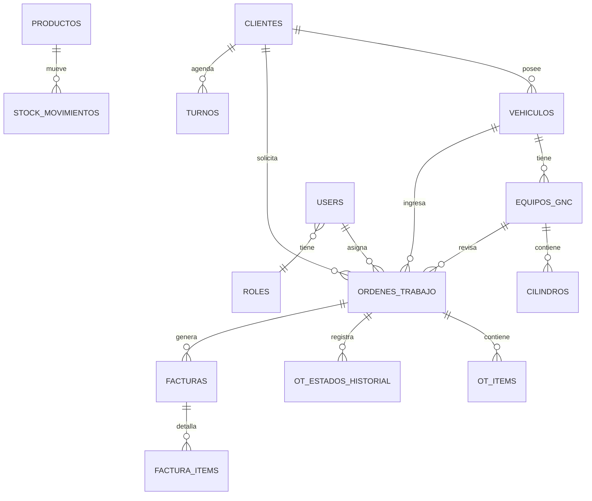

# Modelo de Datos

## ERD Principal (diseño objetivo)

> Nota: este diagrama y el [catálogo](tables-catalog.md) describen el modelo aspiracional (80+ tablas).
> Las migraciones en `apps/backend/database/migrations/` cubren el MVP operativo (~25 tablas de negocio).
> Estado de implementación de módulos: [docs/10-roadmap](../10-roadmap/README.md).



## Estándares de todas las tablas

```sql
id          UUID PRIMARY KEY DEFAULT gen_random_uuid()
created_at  TIMESTAMPTZ NOT NULL DEFAULT NOW()
updated_at  TIMESTAMPTZ NOT NULL DEFAULT NOW()
deleted_at  TIMESTAMPTZ NULL  -- soft delete
```

## Catálogo completo de tablas (85 tablas)

Ver [tables-catalog.md](tables-catalog.md) para definición detallada de cada tabla.

### Módulo Auth & Users (8 tablas)
`users`, `roles`, `permissions`, `role_permissions`, `user_roles`, `access_tokens`, `password_reset_tokens`, `sessions`

### Módulo Clientes (6 tablas)
`clientes`, `cliente_contactos`, `cliente_direcciones`, `cliente_documentos`, `cliente_notas`, `cliente_tags`

### Módulo Vehículos (5 tablas)
`vehiculos`, `vehiculo_marcas`, `vehiculo_modelos`, `vehiculo_documentos`, `vehiculo_historial`

### Módulo Equipos GNC (8 tablas)
`equipos_gnc`, `cilindros`, `reguladores`, `oblea_certificados`, `ph_certificados`, `equipo_componentes`, `equipo_documentos`, `equipo_historial`

### Módulo Órdenes de Trabajo (10 tablas)
`ordenes_trabajo`, `ot_items`, `ot_estados_historial`, `ot_checklist_items`, `ot_fotos`, `ot_notas`, `ot_tiempos`, `ot_repuestos`, `ot_servicios`, `tipos_trabajo`

### Módulo Inventario (9 tablas)
`productos`, `categorias_producto`, `proveedores`, `stock_movimientos`, `stock_actual`, `depositos`, `deposito_ubicaciones`, `ordenes_compra`, `orden_compra_items`

### Módulo Caja (6 tablas)
`cajas`, `caja_movimientos`, `caja_arqueos`, `metodos_pago`, `cobros`, `cobro_items`

### Módulo Facturación (8 tablas)
`facturas`, `factura_items`, `notas_credito`, `tipos_comprobante`, `puntos_venta`, `afip_config`, `afip_logs`, `impuestos`

### Módulo Agenda (4 tablas)
`turnos`, `turno_tipos`, `calendario_bloqueos`, `turno_recordatorios`

### Módulo Dashboard & Reportes (3 tablas)
`dashboard_widgets`, `reportes_config`, `reportes_ejecuciones`

### Módulo Configuración (6 tablas)
`config_taller`, `config_sucursales`, `config_parametros`, `config_feriados`, `config_plantillas`, `config_numeracion`

### Módulo Marketing (4 tablas)
`campanas`, `campana_destinatarios`, `plantillas_comunicacion`, `comunicacion_logs`

### Módulo Auditoría & Seguridad (4 tablas)
`audit_logs`, `login_attempts`, `ip_whitelist`, `security_events`

### Módulo Notificaciones (4 tablas)
`notificaciones`, `notificacion_preferencias`, `notificacion_plantillas`, `notificacion_logs`

### Tablas de soporte (6 tablas)
`archivos`, `etiquetas`, `etiqueta_entidades`, `comentarios`, `adjuntos`, `versiones_documento`

**Total: 85 tablas**
