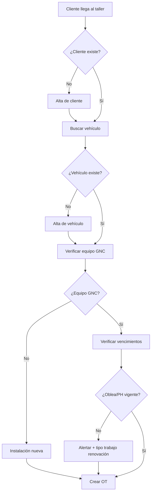

# Reglas de Negocio GNC

## Regulación Argentina

- **ENARGAS**: regula instalaciones de GNC vehicular
- **CRPC**: certifica talleres habilitados
- Toda instalación requiere certificado de oblea
- Cilindros deben tener PH cada 5 años

## Vencimientos

| Concepto | Plazo | Alerta | Acción si vence |
|----------|-------|--------|-----------------|
| Oblea GNC | 1 año desde emisión | 30 días antes | Bloquear circulación, forzar renovación |
| PH Cilindro | 5 años desde última PH | 60 días antes | Retirar cilindro, forzar PH |
| Revisión anual | 1 año | 30 días antes | Notificar cliente |

## Flujo de recepción



## Estados de Orden de Trabajo

Transiciones permitidas:

```
borrador → recepcion
recepcion → en_taller | cancelada
en_taller → en_espera_repuesto | control_calidad | cancelada
en_espera_repuesto → en_taller
control_calidad → finalizada | en_taller (rechazo)
finalizada → entregada
```

## Validaciones críticas

1. Patente única entre vehículos activos
2. Número de serie de cilindro único
3. No más de 4 cilindros por equipo
4. OT no puede pasar a `finalizada` sin checklist completo
5. OT no puede pasar a `entregada` sin cobro registrado (si aplica)
6. Cilindro con PH vencida no puede marcarse como `activo`

## Cálculo de fechas

```typescript
fechaVencimientoOblea = fechaEmisionOblea + 1 año
fechaVencimientoPH = fechaUltimaPH + 5 años
fechaAlertaOblea = fechaVencimientoOblea - 30 días
fechaAlertaPH = fechaVencimientoPH - 60 días
```
