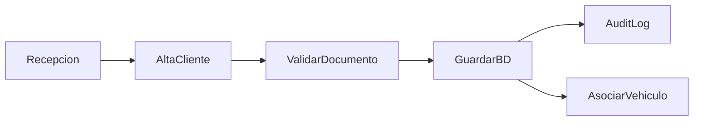

# Módulo: Clientes

## Responsabilidad

Gestión de clientes (personas físicas y jurídicas) del taller.

## Entidades

- Cliente (principal)
- Contactos adicionales
- Direcciones
- Documentos escaneados
- Notas internas

## API Endpoints

```
GET    /api/v1/clientes          # Listar (paginado, filtros)
GET    /api/v1/clientes/:id      # Detalle
POST   /api/v1/clientes          # Crear
PUT    /api/v1/clientes/:id      # Actualizar
DELETE /api/v1/clientes/:id      # Soft delete
GET    /api/v1/clientes/:id/vehiculos  # Vehículos del cliente
```

## Roles con acceso

- Crear/Editar: Recepción, Supervisor, Administrador
- Eliminar: Supervisor, Administrador
- Ver: Todos excepto Invitado (limitado)

## Flujo


