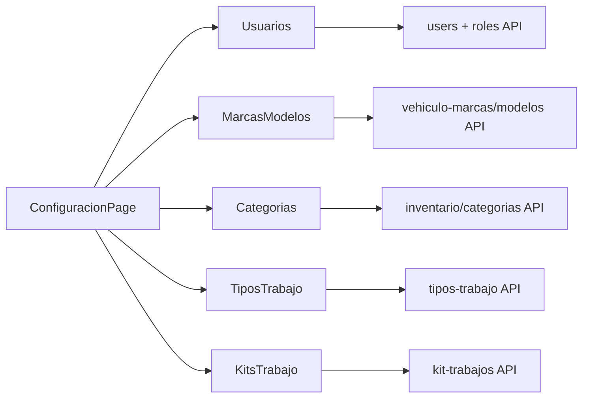

# Módulo Configuración

## Estado: Implementado (hub MVP)

Hub administrativo para catálogos y parámetros operativos del taller.
No es un módulo backend propio; orquesta APIs de Users, Vehículos, Inventario y Órdenes de Trabajo.

## Sub-módulos

| Sección | Ruta | Roles |
|---------|------|-------|
| Hub | `/configuracion` | Administrador, Supervisor, Depósito |
| Usuarios | `/configuracion/usuarios` | Administrador |
| Marcas y modelos | `/configuracion/marcas-modelos` | Administrador, Supervisor |
| Categorías | `/configuracion/categorias` | Administrador, Supervisor, Depósito |
| Tipos de trabajo | `/configuracion/tipos-trabajo` | Administrador, Supervisor |
| Kits de trabajo | `/configuracion/kits-trabajo` | Administrador, Supervisor |

## APIs relacionadas

- `GET/POST/PUT/DELETE /api/v1/users` — solo administrador
- `GET /api/v1/roles` — solo administrador
- `GET/POST/PUT/DELETE /api/v1/vehiculo-marcas` — escritura: admin/supervisor
- `GET/POST/PUT/DELETE /api/v1/vehiculo-modelos` — escritura: admin/supervisor
- `GET/POST/PUT/DELETE /api/v1/inventario/categorias` — escritura: admin/supervisor/depósito
- `GET/POST/PUT/DELETE /api/v1/tipos-trabajo` — escritura: admin/supervisor
- CRUD ítems de kit — `/api/v1/kit-trabajos/...`

## Flujo

## Atajos operativos

- Formulario de producto: modal "+ Nueva categoría"
- Formulario de vehículo: link "Gestionar marcas y modelos"
- Formulario de OT: link "Registrar vehículo" si el cliente no tiene vehículos

## Pendiente

- Parámetros globales del taller (`taller_config`, razón social, logo, etc.)
