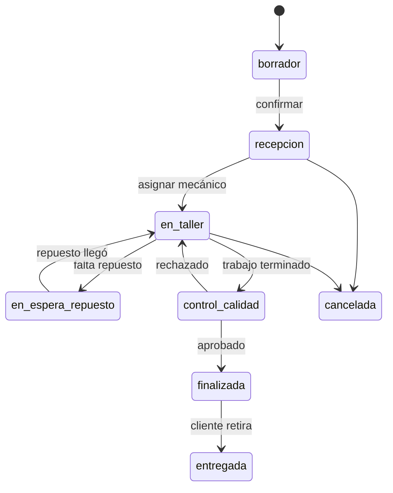

# Módulo: Órdenes de Trabajo

## Responsabilidad

Ciclo de vida completo de una orden de trabajo en el taller GNC.

## Estados

`borrador` → `recepcion` → `en_taller` → `en_espera_repuesto` → `control_calidad` → `finalizada` → `entregada`

## API Endpoints

```
GET    /api/v1/ordenes-trabajo
GET    /api/v1/ordenes-trabajo/:id
POST   /api/v1/ordenes-trabajo
PUT    /api/v1/ordenes-trabajo/:id
PATCH  /api/v1/ordenes-trabajo/:id/estado
POST   /api/v1/ordenes-trabajo/:id/items
GET    /api/v1/ordenes-trabajo/:id/historial
```

## Tipos de trabajo GNC

- Instalación nueva
- Revisión anual
- Renovación de oblea
- Prueba hidráulica
- Reparación / cambio de cilindro
- Desinstalación

## Flujo principal


